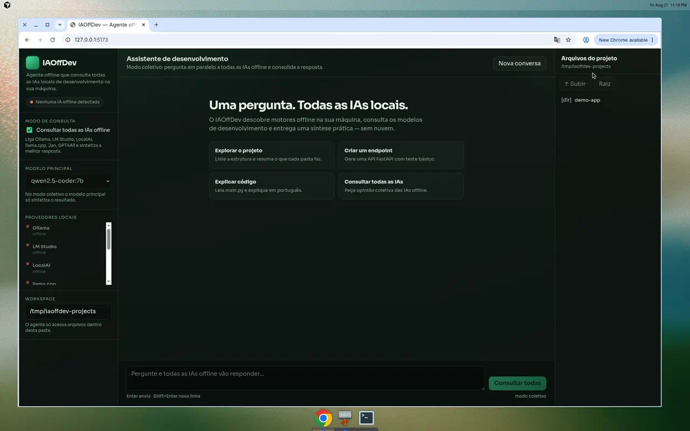

# Telas da interface — IAOffDev

## Tela inicial


## Vista completa



## Como abrir a interface de verdade no Mac

```bash
cd IAOffDev
./scripts/start-backend.sh    # terminal 1
./scripts/start-frontend.sh   # terminal 2
```

Depois abra no navegador: [http://127.0.0.1:5173](http://127.0.0.1:5173)

Ou instale como app:

```bash
./scripts/install-mac.sh
open -a IAOffDev
```
